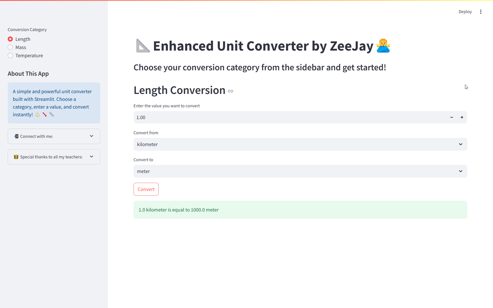
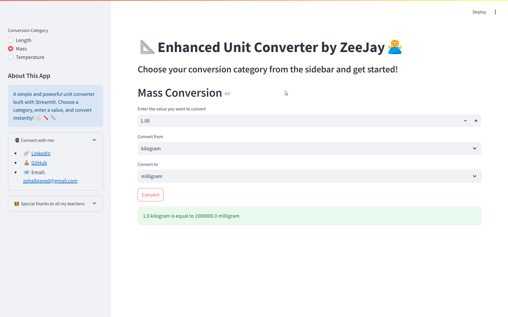
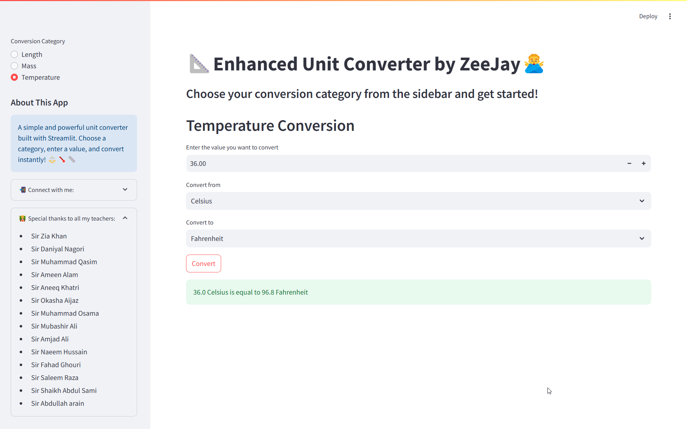

# 📐 Enhanced Unit Converter by ZeeJay 🙅‍♂️

A simple and powerful unit converter built with **Streamlit**. Convert **Length, Mass, and Temperature** instantly with a clean and intuitive interface.

## 🌐 Live Demo
[Check out the live app here!](#)  
_(Replace `#` with the actual deployed link)_

---

## 📸 App Preview

### 🔢 Unit Conversion in Action


### 🎛️ Sidebar & Options


### 📊 Conversion Result


_(Place your actual images in the `images` folder and update paths accordingly)_

---

## 🚀 Features
✅ Convert **Length** (Meters, Kilometers, Centimeters, Millimeters)  
✅ Convert **Mass** (Grams, Kilograms, Milligrams)  
✅ Convert **Temperature** (Celsius, Fahrenheit, Kelvin)  
✅ User-friendly **Streamlit UI** with sidebar navigation  
✅ Instant calculations & error handling  
✅ **Responsive Design** (works on desktop & mobile)  
✅ **Social & Credits** section in the sidebar  

---

## 🛠️ Installation & Usage

1️⃣ **Clone the Repository**
```sh
git clone https://github.com/zohaib-javd/unit-converter.git
cd unit-converter
```

2️⃣ **Install Dependencies**
```sh
pip install -r requirements.txt
```

3️⃣ **Run the Streamlit App**
```sh
streamlit run app.py
```

---

## 📄 How It Works
1️⃣ Select a **conversion category** (Length, Mass, or Temperature) from the sidebar.  
2️⃣ Enter a **value** to convert.  
3️⃣ Choose **From Unit** and **To Unit**.  
4️⃣ Click the **Convert** button to see the result instantly.  

---

## 🤝 Connect with Me
📌 [LinkedIn](https://www.linkedin.com/in/zohaib-javd)  
👨‍💻 [GitHub](https://www.github.com/zohaib-javd)  
📧 Email: **zohaibjaved@gmail.com**  

---

## 🎖️ Special Thanks
💙 Shoutout to my amazing teachers who guided me throughout my learning journey!

- Sir Zia Khan  
- Sir Daniyal Nagori  
- Sir Muhammad Qasim  
- Sir Ameen Alam  
- Sir Aneeq Khatri  
- Sir Okasha Aijaz  
- Sir Muhammad Osama  
- Sir Mubashir Ali  
- Sir Amjad Ali  
- Sir Naeem Hussain  
- Sir Fahad Ghouri  
- Sir Saleem Raza  
- Sir Shaikh Abdul Sami  
- Sir Abdullah Arain  

---

## 🏆 Support & Contributions
Feel free to **fork this project**, submit **pull requests**, or suggest **enhancements**! Your feedback is highly appreciated. 🙌

### ⭐ If you found this useful, give it a **star** on GitHub! ⭐

